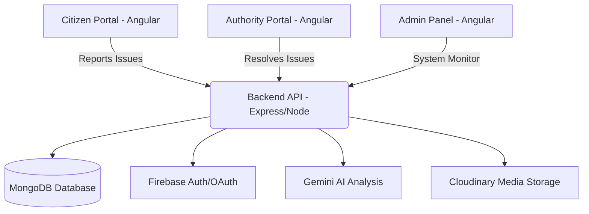

# 🏛️ CivicSense Project Architecture & Chart Sheet

A comprehensive guide to the **CivicSense GovTech Portal** ecosystem. This document serves as the "Master Chart" for developers and system administrators.

---

## 🏗️ System Overview & Architecture

CivicSense is a multi-portal ecosystem designed to bridge the gap between citizens and urban governance using a modern, scalable stack.



---

## 💻 Technology Stack

| Layer | Technology | Purpose |
| :--- | :--- | :--- |
| **Frontend** | Angular 17/18 (Standalone) | High-performance, type-safe web portals. |
| **Backend** | Node.js / Express | Scalable RESTful API architecture. |
| **Database** | MongoDB (Mongoose) | Flexible NoSQL document storage. |
| **Auth** | JWT / Firebase / Google OAuth | Multi-tier secure authentication. |
| **Styling** | Vanilla CSS / TailWind / Material UI | Premium, consistent design system. |
| **AI** | Google Gemini | Automated issue categorization & priority analysis. |
| **Media** | Cloudinary | Cloud-based image & document hosting. |

---

## � Project Functional Chart

### 👤 Citizen Portal (Public/User)
| Feature | Description | Status |
| :--- | :--- | :--- |
| **Landing Page** | Immersive entry point with project highlights. | ✅ Active |
| **User Auth** | Google OAuth & Email/Password login. | ✅ Active |
| **Issue Reporting** | Multi-step form with image upload & AI tagging. | ✅ Active |
| **My Reports** | List & detailed view of user-submitted issues. | ✅ Active |
| **Profile Management**| Update personal details & security settings. | ✅ Active |
| **Real-time Notify** | Integrated notification bell for status updates. | ✅ Active |

### 👮 Authority Portal (Operational)
| Feature | Description | Status |
| :--- | :--- | :--- |
| **Authority HUD** | Dashboard showing issues in assigned zone. | ✅ Active |
| **Task Queue** | List of pending tasks assigned by the system/admin. | ✅ Active |
| **Issue Verification**| Ability to verify and update issue severity. | ✅ Active |
| **Resolution Hub** | Step-by-step resolution updates with evidence. | ✅ Active |
| **Critical Alerts** | High-priority issue flagging for immediate action. | ✅ Active |
| **History Log** | Archive of all resolved issues by the officer. | ✅ Active |

### 🛠️ Admin Panel (Management)
| Feature | Description | Status |
| :--- | :--- | :--- |
| **Global Analytics** | Statistical overview of total/pending/resolved issues. | ✅ Active |
| **User Controls** | Activate/Deactivate/Delete user accounts. | ✅ Active |
| **Role Mgmt** | Assign permissions and promote users to Authority. | ✅ Active |
| **Issue Oversight** | Full CRUD access to all system-wide reports. | ✅ Active |
| **Zone Mgmt** | Create and manage city zones & localities. | ✅ Active |
| **Contact Mgmt** | View and respond to public contact messages. | ✅ Active |
| **System Health** | Monitor API status and database connectivity. | ✅ Active |

---

## 🔌 API & Services Map

| Service | Feature | Status |
| :--- | :--- | :--- |
| **User API** | Registration, Login, Profile, Admin User Mgmt. | ✅ Active |
| **Issue API** | Create, Get, Assign, Bulk Update. | ✅ Active |
| **Geo API** | Forward/Reverse Geocoding & Location Search. | ✅ Active |
| **Upload API** | Direct Cloudinary media streaming. | ✅ Active |
| **Notif API** | System-wide and Role-specific alerts. | ✅ Active |
| **Zone API** | Geographic boundary and locality management. | ✅ Active |


---

## 🗄️ Database Dictionary (Core Models)

### `User` Model
*   `_id`: Object ID
*   `name`: String
*   `email`: String (Unique)
*   `role`: Enum ['citizen', 'authority', 'admin']
*   `isActive`: Boolean
*   `area`: String (Zone for authorities)

### `Issue` Model
*   `_id`: Object ID
*   `title`: String
*   `description`: String
*   `category`: String (Telemetered by AI)
*   `status`: Enum ['Open', 'In Progress', 'Resolved', 'Rejected']
*   `priority`: Enum ['Low', 'Medium', 'High', 'Critical']
*   `location`: { lat: Number, lng: Number, address: String }
*   `reportedBy`: Ref(User)

---

## 🚀 Key Workflows

### 1. Issue Reporting Flow
1. Citizen uploads image & adds description.
2. **Gemini AI** extracts category and assesses priority.
3. System routes the issue to the nearest **Authority** based on geography.
4. Notifications are dispatched via the **Notification Engine**.

### 2. Admin System Check
1. Admin logs into the **Admin Dashboard**.
2. **Auth Interceptor** validates the JWT and handles SSR contexts.
3. Dashboard fetches real-time stats (Total Issues, Active Users, etc.).
4. Admin can activate/deactivate users to maintain system integrity.

---

## 📁 Directory Legend

```text
/civic
├── /admin-panel       # Advanced Management Console (Angular)
├── /authority-panel   # Operational Field Portal (Angular)
├── /citizen-panel     # Public Interaction Portal (Angular)
└── /backend           # Core Engine, Controllers & AI Logic
    └── /src
        ├── /controllers  # Logic Handlers
        ├── /middleware   # Auth & Validation
        ├── /models       # Data Schemas
        └── /routes       # API Endpoints
```

---

## 🛠️ Essential Admin Credentials (Dev)
*   **URL**: `http://localhost:4200/admin/login`
*   **Default Admin**: `admin@civicsense.gov` / `adminpassword123`
*   **API Port**: `5000`

---
### 📝 Recent Updates
*   **[2026-03-08]**: Removed GitHub Social Login (Frontend & Backend integration cleaned).
*   **[2026-03-07]**: Database Dictionary finalized.
*   **[2026-03-05]**: Gemini AI Priority Analysis integrated.

---
*Created on 2026-03-09 | CivicSense GovTech Documentation*

